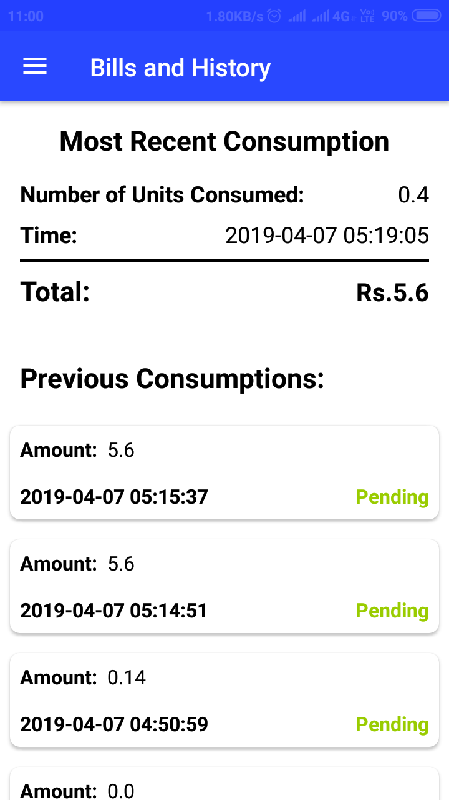
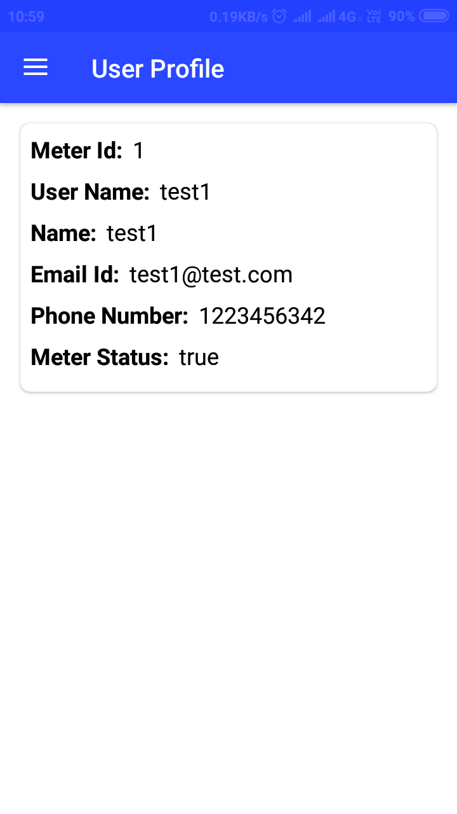

# Android Application

An android application for the users of smart meter.

The app shows the current reading of the user's meter, user's profile details, Bills  and History and user's statistics. 

## Working
App fetches the data from the deployed REST API and renders it on the UI.

## Implementation Details

* **[Volley_Library](https://developer.android.com/training/volley)** is used for sending and receiving the data from the API.
* **[GraphView](http://www.android-graphview.org/)** is used for plotting the graph.
* **[RecyclerView](https://developer.android.com/guide/topics/ui/layout/recyclerview)** is used to render the card list on the Billings and History fragmet.

## Screenshots

<table>
    <tr>
        <td></td>
        <td></td>
        <td></td>
    </tr>
    <tr>
        <td></td>
        <td></td>
        <td></td>
    </tr>
</table>

## Contributing

Found a bug? Create an **[issue](https://github.com/Hsankesara/smart-meter/issues/new)**.