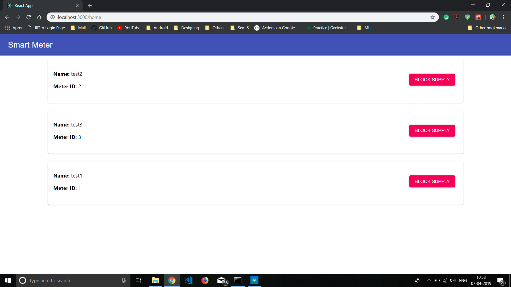
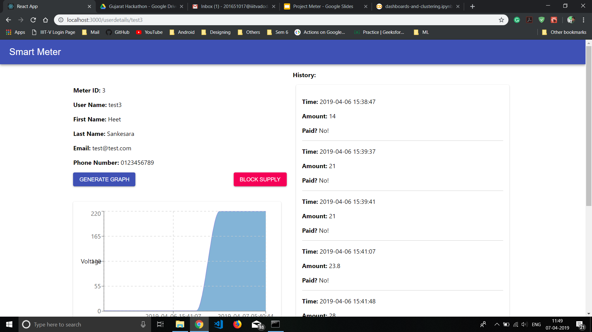

# Web Application

A web app in react for the Electricity Provider Company.

## About

The webapp contains a list of active users. By clicking on any of the users, page redirects to a user details page, where admin can view user's details, bill history, other statistics and can block or unblock a user's power supply. 

## Screeenshots
<table>
    <tr>
        <td></td>
    </tr>
    <tr>
        <td></td>
    </tr>
</table>

## Development

-   Install Backend Dependencies.

```sh
yarn add
```

-   Build the project 

```sh
yarn build
```


-   Run Development Server.

```sh
yarn start
```

---

## Contributing

Found a bug? Create an **[issue](https://github.com/Hsankesara/smart-meter/issues/new)**.